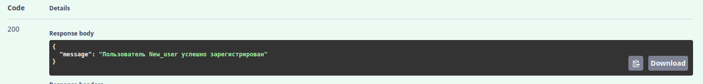
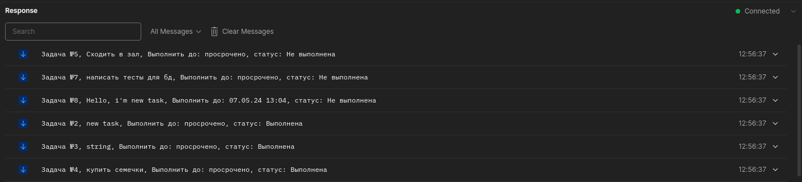

# Realtime Task manager
Task manager, написанный на FastAPI, который позволяет пользователям
отслеживать, добавлять, менять статус задач, а также удалять их.   
Реализована возможность отслеживать изменения в списке задач в режиме реального времени с помощью технологии Websocket.   
Безопасность конечных точек обеспечена при помощи аутентификации с помощью JWT-токена, а также ролевому доступу к некоторым операциям.

### Содержание:
* [Используемые технологии](#используемые-технологии-)
* [Запуск проекта локально](#запуск-проекта-локально)
* [Тестирование проекта с помощью Swagger UI](#тестирование-проекта-с-помощью-swagger-ui)
* [Подключение по Websocket](#подключение-по-websocket)
* [Запуск приложения с помощью Docker compose](#запуск-приложения-с-помощью-docker-compose)

### Используемые технологии: 
* Python
* FastAPI
* SQLAlchemy
* Pydantic
* PostgreSQL
* Alembic
* Pytest
* JWT
* docker-compose

### Запуск проекта локально
1. Клонируйте проект с помощью команды:  
git clone https://github.com/mike-sazonov/FastAPI_currency_project.git
2. Настройте виртуальную среду
3. В корне проекта создайте файл .env и заполните своими данными по примеру:  
DB_HOST=localhost 
DB_PORT=5432 
DB_USER=postgres 
DB_PASS=db_pass 
DB_NAME=db_name 
DB_NAME_TEST=db_name_test 
SECRET_KEY=secret_key 
ALGORITHM=algorithm 
SALT=salt 
4. Командой **python -m pytest tests/** запускаем тесты.
5. Перед первым запуском проекта, совершаем первую миграцию с помощью Alembic: 
* Командой **alembic revision --autogenerate**, проверяем миграцию по адресу: Директория_проекта/alembic/versions
* Командой **alembic upgrade head** вносим изменения в нашу БД.

### Тестирование проекта с помощью Swagger UI

* **Запустите проект из файла main.py, после чего перейдите по ссылке** http://127.0.0.1:8000/docs.  
* **В открывшемся интерфейсе зарегистрируйте нового пользователя:**

Если регистрация прошла успешно, мы получим ответ:

* **Теперь мы можем авторизоваться, введя данные только что созданного пользователя:**

После успешной аутентификации, мы получим доступ к CRUD для наших задач.(Только роль admin имеет доступ к добавлению и удалению задач)
* **Получение задачи по id (GET):**

Ответ:

В теле ответа мы видим номер задачи, её содержание, срок выполнения, а также статус.
Срок автоматически изменится на "просрочено", когда время на выполнение задачи истечет

* **Добавление новой задачи (POST):**

При добавлении новой задачи, по умолчанию срок выполнения установлен в значении 30 минут. Мы можем поставить срок выполнения задачи, изменив параметр "execution_time"в теле запроса по следующему шаблону:
P{кол-во дней}DT{кол-во часов}H{кол-во минут}M
* **Изменение статуса задачи (PUT):**

Выбрав задачу по id, можно задать ей один из двух доступных статусов выполнения
* **Удаление задачи (DELETE):**

### Подключение по Websocket
Для подключения по websocket, воспользуемся сервисом Postman
* Создайте новую сессию в postman, выбрав метод запросов websocket:

* Введите адрес для подключения **ws://localhost:8000/task/task_board/** и нажмите Connect
* Введите ваш JWT-токен и отправьте (JWT-токен можно взять из Swagger UI в параметрах Curl):

* Websocket в ответе выдаст список всех задач:

Далее при отправлении любого сообщения на websocket, в ответ мы будем получать список задач.
* Сообщения от websocket, когда совершаются какие-либо действия с задачами:

### Запуск приложения с помощью Docker compose
* Для запуска приложения с помощью Docker compose, в корневой папке создайте файл docker.env со своими данными:  
DB_HOST=db 
DB_PORT=5432 
DB_USER=postgres 
DB_PASS=db_pass 
DB_NAME=db_name 
DB_NAME_TEST=db_name_test 
SECRET_KEY=secret_key 
ALGORITHM=algorithm 
SALT=salt 

* В консоли запускаем проект командой: docker compose up
